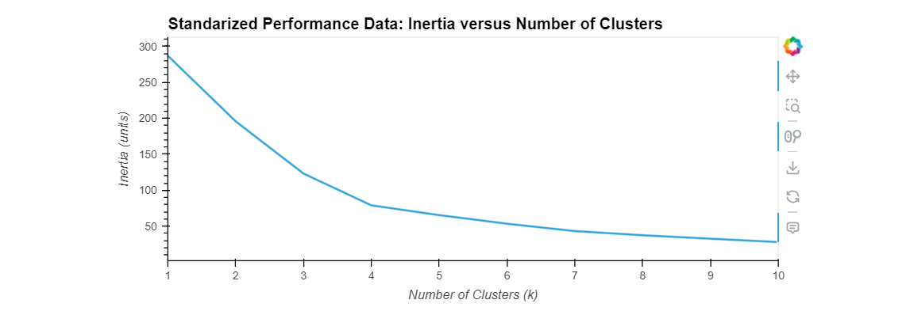
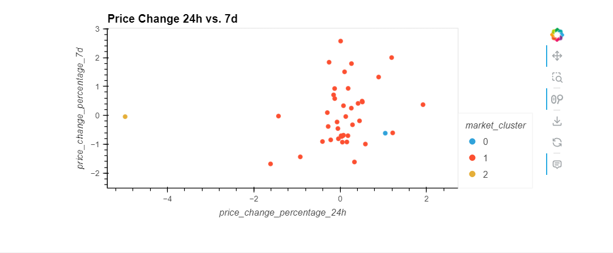
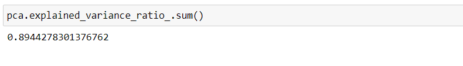
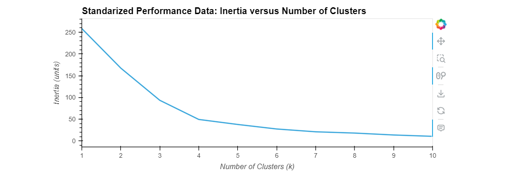
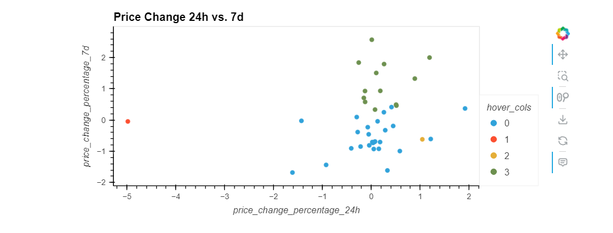
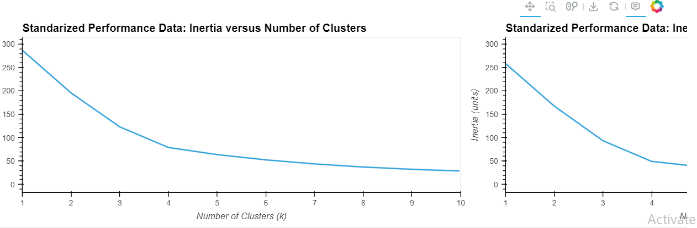
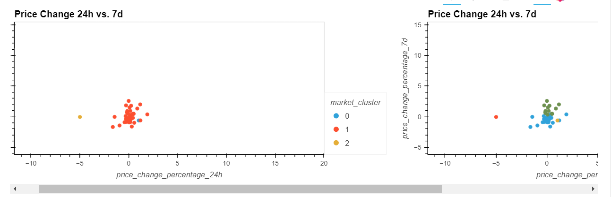

# CryptoClustering

Crypto Clustering
In this challenge, there is use of Python and unsupervised learning to predict if cryptocurrencies are affected by 24-hour or 7-day price changes. The crypto_market_data.csv data analyzed can be found under Resources folder.

These were the steps followed to prepare the data:

Use the StandardScaler() module from scikit-learn to normalize the data from the CSV file.
Create a DataFrame with the scaled data and set the "coin_id" index from the original DataFrame as the index for the new DataFrame.

We found that based on the elbow curve, the best value for K is 4 by using the original scaled.

We clustered Cryptocurrencies with K-means Using the Original Scaled Data
To plot the cluster graph we used hvPlot by setting the x-axis as 'price_change_percentage_24h' and the y-axis as 'price_change_percentage_7d'.

Optimize Clusters with Principal Component Analysis.
By using the original scaled dataFrame, a PCA was performed to reduce the features to three principal components.
The total explained variance of the three principal components is 89.

We found the best value for k usign the PCA data. The best value is 4 which does not differ from the k value using the original scaled.
We clustered Cryptocurrencies with K-means Using the PCA Data.

To plot the cluster graph we used hvPlot by setting the x-axis as 'price_change_percentage_24h' and the y-axis as 'price_change_percentage_7d'.

The last step was to visually analyze the cluster analysis results by contrasting the outcome with and without using the optimization techniques.

After analyzing the cluster results, I realized some areas change color and even though the results seem the same, the blue results (0), changed to half color to red (1) and that a some results that were yellow (2) or red (1) before, changed in the PCA cluster analysis.